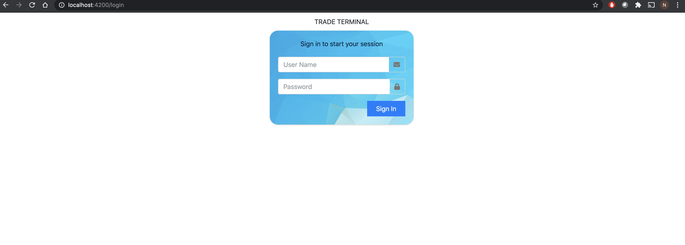
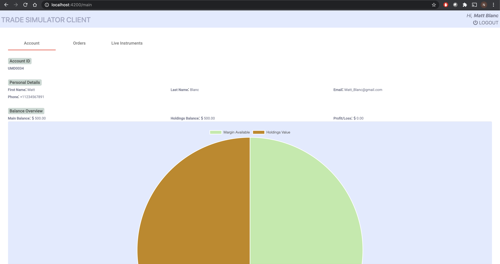
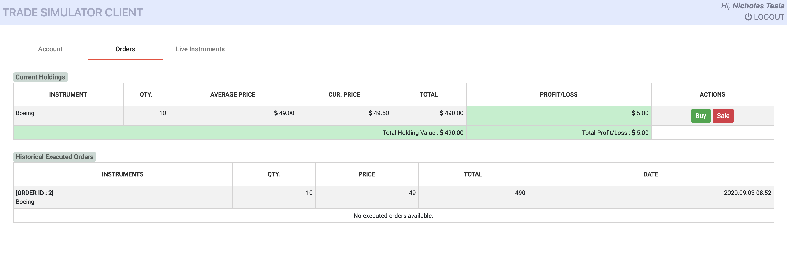

# TradeClient
## Pre-requisite
    Node 12 and above
    Angular CLI ( >9.0.0)
This project was generated with [Angular CLI](https://github.com/angular/angular-cli) version 9.0.5.

## Install and Build

    1. Copy project to a desired folder.
    2. Navigate to folder having package.json
    3. run "npm install"
    4. run "npm start"
    
   

   

    

    

    
 
    
## Development server

    Run `ng serve` for a dev server. Navigate to `http://localhost:4200/`. The app will automatically reload if you change any of the source files.

## Code scaffolding

    Run `ng generate component component-name` to generate a new component. You can also use `ng generate directive|pipe|service|class|guard|interface|enum|module`.

## Build

    Run `ng build` to build the project. The build artifacts will be stored in the `dist/` directory. Use the `--prod` flag for a production build.

## Running unit tests

    Run `ng test` to execute the unit tests via [Karma](https://karma-runner.github.io).

## Running end-to-end tests

    Run `ng e2e` to execute the end-to-end tests via [Protractor](http://www.protractortest.org/).

## Further help

    To get more help on the Angular CLI use `ng help` or go check out the [Angular CLI README](https://github.com/angular/angular-cli/blob/master/README.md).
